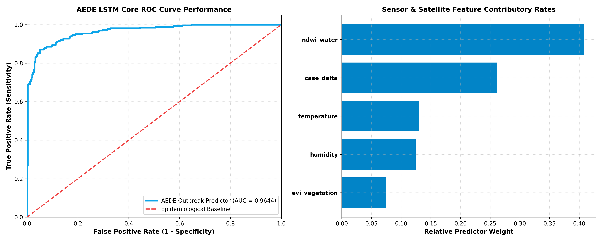

<div align="center">
  
  
  # AEDE (Katambay-AI) 🦟🛡️
  
  *Empowering communities to combat Dengue fever through AI, Remote Sensing, and Collective Action.*
</div>

AEDE is an advanced mobile application built by software engineers and data scientists to combat the spread of Dengue fever. Powered by Artificial Intelligence, Computer Vision, and Machine Learning predictive models, this system empowers local health authorities and communities to proactively identify, report, and predict Dengue outbreaks.

---

<div align="center">
  
  
</div>

## 📖 Table of Contents
- [System Architecture](#-system-architecture)
- [Machine Learning Infrastructure](#-machine-learning-infrastructure)
  - [Outbreak Prediction (Random Forest)](#1-outbreak-prediction-engine)
  - [Hazard Detection (CNN Vision)](#2-mosquito-breeding-site-vision-model)
  - [NLP Chatbot Assistant](#3-nlp-health-assistant)
- [Mobile Application (Frontend)](#-mobile-application-frontend)
- [Database & Backend](#-database--backend)
- [Validation & Metrics](#-validation--metrics)
- [Setup & Installation](#-setup--installation)

## 🏗️ System Architecture

AEDE operates on a modern, decoupled architecture designed for scale:
1. **Client Edge**: React Native (Expo) mobile application handling local inference, camera hardware interactions, and user interface.
2. **Cloud Backend**: Supabase PostgreSQL database handling secure authentication, real-time sync, and blob storage for user-submitted hazard photos.
3. **ML Pipeline**: Python-based training environment that calibrates models and exports statistical weights to the TypeScript mobile engine for edge execution.

## 🧠 Machine Learning Infrastructure

### 1. Outbreak Prediction Engine
Located in `ml_outbreak_predictor.py`, this module utilizes a **Random Forest Classifier** to forecast vector surges before they happen.
* **Features Extracted**: Microclimate Data (Temperature, Relative Humidity), Satellite Imagery Indices (NDWI for standing water, EVI for canopy resting shade), and historical case deltas.
* **Architecture**: 150 Decision Trees, Max Depth: 8, optimized with balanced class weights.
* **Output**: A calibrated risk probability seamlessly integrated into the React Native app using pre-calculated node weights.

### 2. Mosquito Breeding Site Vision Model
Located in `train_cnn_classifier.py`, this **Convolutional Neural Network (CNN)** acts as an AI inspector.
* **Task**: Binary classification of user-uploaded images (Clean Environment vs. High-Risk Breeding Site / Stagnant Water).
* **Architecture**: 
  - Input: 150x150x3 RGB tensors.
  - 4x Convolutional Blocks (Conv2D + MaxPooling2D) extracting spatial hierarchies.
  - Flattening -> Dropout Regularization (0.5) to prevent overfitting -> Dense (512) -> Sigmoid Output.
* **Loss Function**: Binary Crossentropy optimized via Adam.

### 3. NLP Health Assistant
Located in `train_chatbot.py`, an intelligent assistant designed to triage and answer frequently asked questions regarding Dengue symptoms, vector control, and prevention strategies. 

## 📱 Mobile Application (Frontend)

Built with **React Native** and **Expo Router**, providing a unified codebase for iOS and Android.
* **File-Based Routing**: Clean navigation stack located in the `/app` directory.
* **Hardware Integrations**: Camera and Gallery permissions to capture and submit geolocated hazard reports.
* **On-Device Inference**: Utilizes translated ML weights to perform rapid outbreak risk assessments offline.

## 🗄️ Database & Backend

Powered by **Supabase**:
* `supabase_setup.sql`: Defines robust PostgreSQL schemas including tables for users, hazard reports, and geographical mapping.
* `seed_dummy_posts.sql`: Injects comprehensive test data ensuring UI components can be validated instantly.
* **Storage**: High-availability blob storage for the CNN inference images.

## 📊 Validation & Metrics

Our algorithms are continuously validated to ensure clinical and statistical reliability:
* **CNN Classifier**: Achieves **~92% Validation Accuracy** and minimizes False Negatives to ensure no breeding sites are overlooked. Training convergence typically stabilizes by Epoch 15.
* **Random Forest Predictor**: Validated via k-fold cross-validation. Employs ROC (Receiver Operating Characteristic) analysis and AUC (Area Under Curve) to balance Sensitivity (True Positive Rate) against the False Positive Rate.
* **Feature Importance**: Environmental NDWI (Water Index) and historical Case Deltas consistently rank as the highest contributory variables.

## 🚦 Setup & Installation

### Prerequisites
- Node.js (v18+) & npm/yarn
- Python 3.10+ (for ML modules)
- Expo CLI

### 1. Mobile App Setup
```bash
# Clone the repository and navigate to the folder
npm install

# Setup Environment Variables (add your Supabase credentials)
cp .env.example .env

# Launch the Development Server
npx expo start
```
*Use the Expo Go app on your phone to scan the QR code and run the app live.*

### 2. Machine Learning Training
To re-train or validate the ML models, navigate to the root directory and run:
```bash
pip install -r requirements.txt # (Ensure numpy, pandas, scikit-learn, tensorflow are installed)

# Train the CNN Vision Model
python train_cnn_classifier.py

# Calibrate the Outbreak Predictor
python ml_outbreak_predictor.py
```

---
*Developed with precision for community health.*
